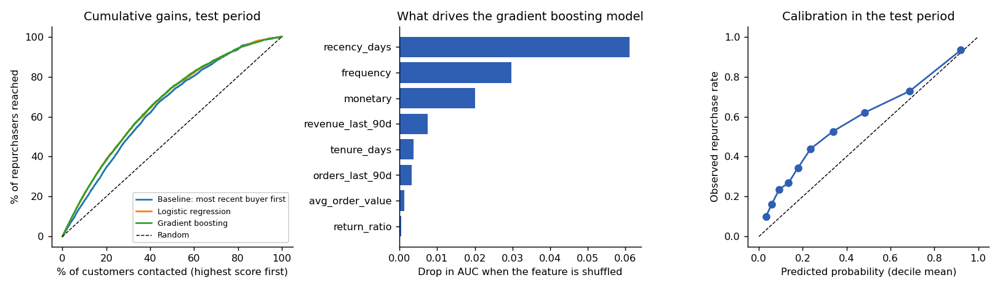
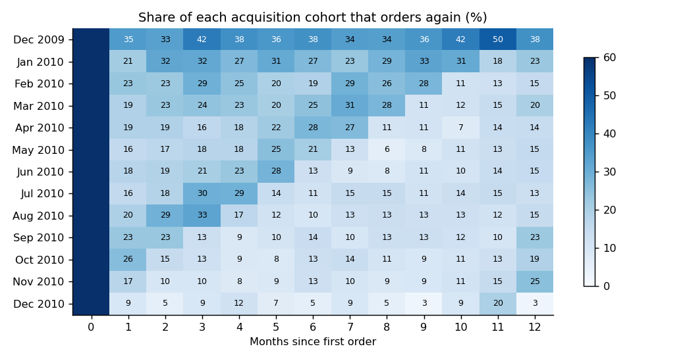
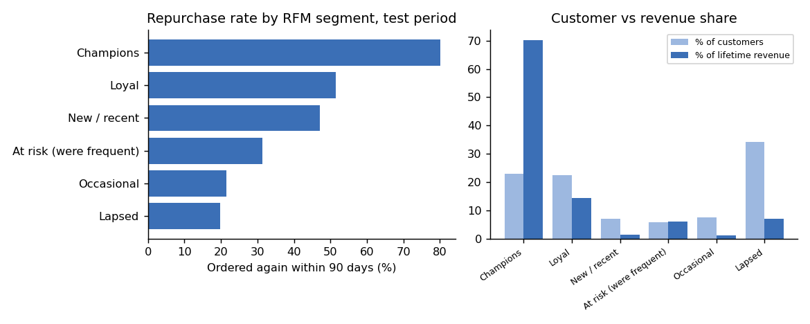

# Customer retention and reactivation analysis

[](https://github.com/MaHmOuDeB/customer-retention-rfm/actions/workflows/ci.yml)


Who comes back, who has gone quiet, and which lapsed customers are worth a win-back offer? Two years of orders from a UK
online gift retailer, analysed with SQL (DuckDB) and scikit-learn: cohort retention, RFM segments, a repurchase model
tested on a later period, and a sample-size plan for a win-back experiment.

*Rebuilt in 2026 from my Master's project "Customer Segmentation" (2024). That project clustered a customer summary
file; this version uses order-level data, so it can answer retention questions the original could not.*

**Why it matters for a subscription business:** swap "repurchase in 90 days" for "renews next month" and the same pipeline
becomes a churn analysis: cohort curves, a rule-of-thumb baseline the model must beat, and an experiment to measure what a
save offer is actually worth.

## Results at a glance

| Question | Answer |
|---|---|
| How many customers come back? | In the 2010 cohorts, about 20% order again in month 1 and about 18% still order in month 12 |
| Where does the revenue come from? | The "Champions" segment (top fifth on recency, frequency and spend; 23% of customers) holds 71% of spend up to Sept 2011, partly by construction; the dormant third of customers holds 7% |
| Can a model predict who orders in the next 90 days? | Yes, but a recency rule does most of the work: AUC 0.79 versus 0.76, a gain of 0.03 (95% CI 0.02 to 0.04) |
| Which customers with no order in 90 days are most likely to return? | The top 10% by model score returned at 64%, versus 29% for all of them |
| What should happen next? | A holdout experiment: the model predicts who returns, not who a campaign would change |



## Data

[UCI Online Retail II](https://archive.ics.uci.edu/dataset/502/online+retail+ii): 1,067,371 invoice lines, 1 Dec 2009 to 9 Dec 2011.

| Step | Rows |
|---|---|
| Raw invoice lines | 1,067,371 |
| Without a customer ID (dropped, they cannot be followed over time) | -243,007 |
| Cancellation lines (returns, handled separately) | -18,744 |
| Postage, bank charges, adjustments, zero or negative quantity or price | -2,988 |
| **Sales lines** | **802,632** |
| Order lines reversed within 24 hours (see below) | -1,498 |
| **Clean sales lines used** | **801,134** |

5,850 customers, 36,452 orders, £17.0M revenue.

**Reversed orders.** A cancellation that undoes an order line for the same customer, product and quantity within 24 hours is
treated as an order that never happened, and both lines are removed (£407k of revenue). The reason: one mis-keyed order of
74,215 units was cancelled the same day, and without this rule it counts as £77k of revenue and again as £77k of returns.
Returns after more than a day, or for part of an order, stay in.

## Method

- **SQL models** (`sql/`): cleaning, snapshot features and cohorts. Tests run the cleaning SQL on synthetic invoices.
- **Out-of-time evaluation:** features are built as of a cutoff date and the label is "ordered again in the next 90 days".
  The model trains on the 10 June 2011 snapshot and is scored on the 9 September 2011 snapshot. Unit tests check that
  features use only data up to the cutoff and that the label window is exactly 90 days.
- **Models:** a "most recent buyer first" rule, logistic regression and gradient boosting. The AUC gain over the rule comes with a
  paired bootstrap interval (500 resamples). That interval reflects test-sample variance only: one split, one window.
- **Segments:** rule-based RFM segments (quintile scores from average ranks, so identical customers always get identical scores),
  plus k-means on log-scaled RFM to see how much structure the data has.
- **Reproducible:** fixed seeds and a fixed row order; two runs give byte-identical results.

## Findings

**Retention is low and flat after month 1.** The heatmap shows the Jan to Nov 2010 cohorts, and the averages are weighted by cohort
size. Dec 2009 is left out because the data starts that month, so that cohort contains customers who were already buying, and
Dec 2010 is left out because its month 12 is only nine days of data. Month N means N calendar months after the month of the first order. The bounce in the later cohorts at months 11 and 12 likely reflects seasonal buying.



**Spend is concentrated, partly by construction.** Champions are the top fifth on recency, frequency and spend, so their share of
spend is high by definition; the useful part is the contrast. They reorder within 90 days 80% of the time, the dormant segment about 20%.
Spend here is cumulative up to Sept 2011 for customers who existed then.



**The structure in the data is one main divide.** Silhouette is highest at k = 2 (0.46, active repeat buyers versus dormant
customers), with k = 4 next (0.38). I would not claim six natural groups: the finer RFM segments are rules for action, not clusters.

**Recency does most of the work.** Scored on the September snapshot (base rate 43.5%):

| Model | ROC AUC | Precision in top 10% | Lift in top 10% |
|---|---|---|---|
| Most recent buyer first | 0.762 | 78% | 1.8x |
| Logistic regression | 0.792 | 91% | 2.1x |
| Gradient boosting | 0.793 | 93% | 2.1x |

Recency, then frequency and total spend, drive the prediction. Among customers with no order in the 90 days before the cutoff,
the model's edge over the rule is smaller (AUC 0.710 versus 0.685, gain 0.025, 95% CI 0.012 to 0.038) but clear of zero.

**The model ranks well but under-predicts.** Observed repurchase is higher than predicted in every decile (right panel above). The
test window is the pre-Christmas peak (43.5% repurchase versus 32% in the training window), which is the likely cause, but I did not
test it: there is one training window and one test window. Rankings are what matter for picking a contact list; absolute probabilities
would need recalibrating before use.

## Recommendation

"Lapsed" below means no order in the 90 days before the cutoff: 3,351 customers, of whom 29% ordered anyway in the next 90 days.
(The RFM segment called "Dormant" is a different, stricter group.) Contacting the 335 highest-scored (10%) reaches 216 returners
and about £180k of next-90-day revenue, versus about 97 returners and £58k for 335 random lapsed customers. **That is not the
value of a campaign:** those customers are the likeliest to return on their own, so most of that revenue would have arrived
without any offer.

To measure what an offer is worth, split the target list at random into contact and holdout groups. Customers needed per arm
(two-sided, 5% level, 80% power):

| Target group | Baseline return rate | +2 pp | +3 pp | +5 pp |
|---|---|---|---|---|
| All lapsed customers | 29% | 8,240 | 3,696 | 1,353 |
| Top 20% of lapsed by score | 53% | 9,733 | 4,317 | 1,547 |

The 53% baseline is taken from the same peak-season window, so it is optimistic. At this retailer's size only a +5 pp or larger uplift
could be detected in one round, and only on the full lapsed list (2 x 1,353 customers). The top-20% list has just 670 customers, far
fewer than any arm needs, and the likeliest returners are also the hardest group to test because their high baseline leaves less room
to improve. A practical design is to run the test over several months or to include mid-ranked customers.

## Limits

- **Prediction, not causation.** Nobody in this data was contacted.
- **Seasonality.** One test window, the peak season. Ranking metrics should transfer better than absolute rates.
- **One retailer, 2009 to 2011.** Many customers are businesses buying wholesale, so patterns may not transfer to a consumer subscription.
- **About 23% of invoice lines have no customer ID** and are excluded.
- **The 24-hour reversal rule is a judgement call.** It removes £407k of revenue that was ordered and cancelled; a different window would move the totals slightly.

## Reproduce

```bash
make setup      # pip install -r requirements.txt
make data       # downloads UCI Online Retail II (45 MB) and converts it to Parquet (a few minutes)
make analysis   # writes reports/results.json and reports/figures/
make test       # unit tests on synthetic data, no download needed
make lint
```

## Repo layout

```
sql/        01_clean (with the 24-hour reversal rule), 02_features (as of a cutoff + 90-day label), 03_cohorts
src/        download.py, prepare.py, analysis.py (statistics and figures)
tests/      cleaning, feature windows and label, scoring helpers, sample-size formula
reports/    results.json and figures
```

Data: Chen, D. (2012). Online Retail II. UCI Machine Learning Repository, CC BY 4.0.
